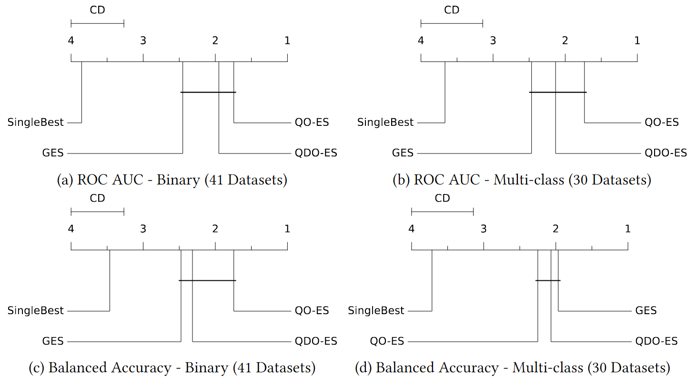
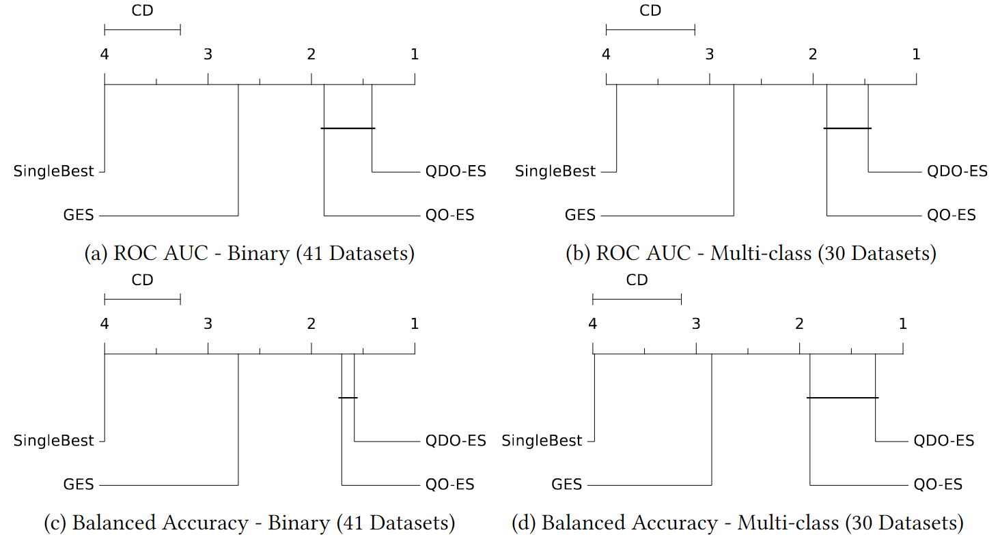

# [Reproducibility Repository] Q(D)O-ES: Population-based Quality (Diversity) Optimisation for Post Hoc Ensemble Selection in AutoML

This repository is related to the paper "Q(D)O-ES: Population-based Quality (Diversity) Optimisation for Post Hoc
Ensemble Selection in AutoML".
It provides the code used to generate and save the base models' data and run the ensemble methods on the base models'
data.
This README provides a short overview of the code base before showing how to reproduce our results.

We ran the scripts provided in this repository in a highly parallel manner across specific hardware.
We do not provide the code for parallelization in this repository as it is hard-coded and designed for the used hardware
and does not translate to other systems.
Instead, we provide a minimal example and all information necessary to run the code and leave it to the user to
parallelize the scripts if needed.

### Paper TL;DR

Two Novel Population-based Methods for Post Hoc Ensemble Selection in AutoML.

### Paper Abstract

Automated machine learning (AutoML) systems commonly ensemble models post hoc to improve predictive performance,
typically via greedy ensemble selection (GES). However, we believe that GES may not always be optimal, as it performs a
simple deterministic greedy search. In this work, we introduce two novel population-based ensemble selection methods,
QO-ES and QDO-ES, and compare them to GES. While QO-ES optimises solely for predictive performance, QDO-ES also
considers the diversity of ensembles within the population, maintaining a diverse set of well-performing ensembles
during optimisation based on ideas of quality diversity optimisation. The methods are evaluated using 71 classification
datasets from the AutoML benchmark, demonstrating that QO-ES and QDO-ES often outrank GES, albeit only statistically 
significant on validation data. Our results further suggest that diversity can be beneficial for post hoc ensembling 
but also increases the risk of overfitting.

## Results Teaser
The goal of _post hoc ensembling_ for AutoML is to aggregate a pool of base models consisting of all models that are
trained and validated during an AutoML system's model selection or a subset thereof.

In our paper, we proposed `QO-ES` and `QDO-ES`, two new population-based ensemble selection methods to perform post hoc 
ensembling in AutoML. We compared the new methods to `GES` and the single best model (no ensembling) `SingleBest`

Below are the Critical Differences (CD) plots w.r.t. **test scores** for binary and multi-class classification for the 
71 datasets from the AutoML benchmark. The plots are additionally split for balanced accuracy and ROC AUC, because 
these represent different optimization problems. Methods connected by a vertical bar are not significantly different. 
The axis at the top and the line connected to a method's name indicate the mean rank of the method. The lower the rank,
the better the method.

#### Results w.r.t. **test scores**:


#### Results w.r.t. **validation scores**:


For more details and results, see our paper (links can be found at the bottom of the README).

## Data

Parts of our code generated data that we used in our paper.
To access the data, please see: [DOI](https://doi.org/10.6084/m9.figshare.23613627).

## Content Overview

* `assembled_ask`: Contains the code to run Auto-Sklearn 1.0 on the dataset from the AutoML benchmark and save data for
  base models.
* `assembled_ensemlbes`: Contains all code related to running ensemble methods.
* `benchmark`: Contains the setup data for the benchmark, results, and evaluation data.

## Reproducibility Workflow - Minimal Example

The following provides a minimal example for each part of the code that we created for this publication.
Each part can be done independently and does not require a previous part to be run first.

### Reproducing: Generating Base Model with Auto-Sklearn

Please refer to `./assembled_ask/README.md` for details.

### Reproducing: Running Post Hoc Ensembling Methods

Please refer to `./assembled_ensembles/README.md` for details.

### Reproducing: Plots and Evaluations

Please refer to `./benchmark/evaluation/README.md` for details.


## Relevant Publication

If you use our code or the data produced by our code in scientific publications, we would appreciate citations.

**Q(D)O-ES: Population-based Quality (Diversity) Optimisation for Post Hoc Ensemble Selection in AutoML**,
_Lennart Purucker, Lennart Schneider, Marie Anastacio, Joeran Beel, Bernd Bischl, Holger Hoos_,
_Second International Conference on Automated Machine Learning, 2023_. 

Link to publication: [OpenReview](https://openreview.net/forum?id=zvV7hemQmtLl) and [arXiv](https://arxiv.org/abs/2307.08364)

Link to teaser video: [YouTube](https://www.youtube.com/watch?v=wzvCSN-94Hs&list=PLp7L30nGpKM8_lzMdDbUnYXUlfBGH_EA2&index=10)

Link to full video: [YouTube](https://www.youtube.com/watch?v=E8d-se0COIo&list=PLp7L30nGpKM-6Y7LQdtb6TWX3o1d9BDSs&index=13)

```
@inproceedings{
  purucker2023qdoes,
  title={Q(D)O-{ES}: Population-based Quality (Diversity) Optimisation for Post Hoc Ensemble Selection in Auto{ML}},
  author={Lennart Purucker and Lennart Schneider and Marie Anastacio and Joeran Beel and Bernd Bischl and Holger Hoos},
  booktitle={AutoML Conference 2023},
  year={2023},
  url={https://openreview.net/forum?id=zvV7hemQmtLl}
}
```
